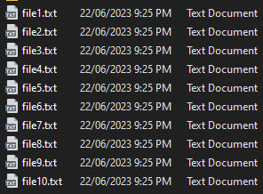
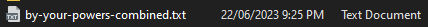

# TEXT FILE COMBINER

As the name would suggest, this 'ere Electron app combines the contents of multiple text files (ew) into one glorious file (woo).

It should also be noted that this is designed for WINDOWS users (MAC and LINUX coming soon™).
<br><br>

**📜 SKIP TO THE GOOD BITS:**

- [Example use case](#example-use-case)
- [Notes for Students](#notes-for-students)
  - [Recreate this project step-by-step](#👉-to-recreate-this-project-step-by-step)
  - [See your project in action before deploying it](#👉-see-your-project-in-action-ie-test-it-before-deploying-it)
  - [Build/Deploy your final Electron app](#👉-builddeploy-your-final-electron-app)
- [Inline comments](#👍-inline-comments)
- [Contributions](#contributions)
- [Licence](LICENSE)

<br><br>

# EXAMPLE USE CASE

Little Timmy has 10 individual text files, and he wants to whack them into one single text file.

### 😭 Sad Timmy



### 😎 Happy Timmy



<br><br>

# NOTES FOR STUDENTS

## 👉 Recreate this project step-by-step:

1. Create a new git repo (with Github Desktop) and then open the repo in your external editor (`Ctrl + Shift + A`)
2. Open a new terminal in your editor.
3. Set up Node.js:

   ```bash
   npm init
   ```

4. Install the dev dependency, [Electron Forge CLI](https://www.electronforge.io/cli):

   ```bash
   npm install --save-dev @electron-forge/cli
   ```

5. Install the other required dependencies:

   ```bash
   npx electron-forge import
   ```

6. Create the following five (5) files in the root of your project:

   - `index.html`
   - `style.css`
   - `main.js`
   - `preload.js`
   - `renderer.js`

7. Edit the files accordingly (or copy&paste the file contents from this here repo).

## 👉 See your project in action (i.e. test it before deploying it)

```bash
npm start
```

## 👉 Build/Deploy your final Electron app:

A distributable file will be made based on the OS you're working within. So, if your computer is running Windows, the following command will create a file for other Windows users. To make the program available to Mac/Linux users, you either need to `npm run make` the app on computers using those environments, or get fancy with the 'GitHub Actions workflow'. I'll leave the latter to your excellent Googling abilities!

```bash
npm run make
```

<br><br>

# 💬 INLINE COMMENTS

I've tried to provide as many comments as possible for beginners. This is something I've found to be sorely missing from 'beginner-friendly' projects, so have endeavoured to include as many as I can here.

Please reach out if you find the comments confusing and I will modify them where appropriate.

<br><br>

# 🤝 CONTRIBUTIONS

Thank you for your interest in contributing to this project. While we do appreciate your support, we are unfortunately not accepting contributions at this time. Having said that, we encourage you to check back in the future for any updates or changes to our contribution guidelines.

Feel free to fork the project and customize it for your own use. If you encounter any issues or have suggestions, please do your thang.

Thanks, and happy travels!
